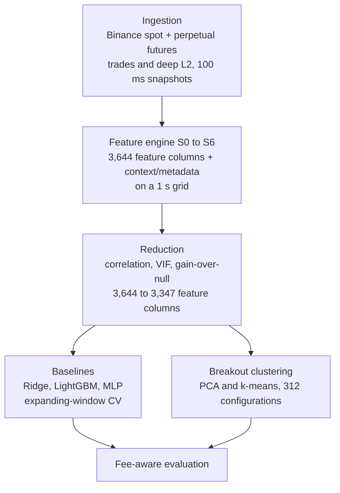

# Feature-Combination States for Short-Horizon Prediction in Cryptocurrency Market Microstructure

Master project, MSc Information Management, NOVA IMS, 2026. A modular research pipeline that
turns Binance limit-order-book and trade data into a corpus of 3,644 microstructure feature
columns covering order-flow imbalance and taker aggression, queue and depth dynamics,
liquidity provision, withdrawal and absorption, price impact, spot-futures and cross-asset
structure, and price position relative to reference levels. The corpus is reduced against a
null-importance baseline, and the retained features are then used to test whether breakout
events fall into recurring **feature-combination states** that separate continuation from
reversal, and whether that separation survives out-of-sample assignment and exchange fees.

The pipeline is symbol-parametric throughout. A single trade adapter and a single order-book
adapter take symbol and market type as arguments, and every stage from ingestion to the
cross-asset layer is written against an asset set rather than against hardcoded pairs, so
extending the study to further assets is a configuration change that spawns all dependent
adapters, queues and writers. The reported analysis covers BTC/USDT and ETH/USDT on spot and
USDT-margined perpetual futures over a continuous three-month window.

## Key finding

Two coherent reversal states are identified, one per asset, and both can be described in
microstructural terms. Given cluster membership their events reverse with a directional
accuracy of 0.73 and 0.78 at the 60 s horizon. The result is nonetheless negative, for two
reasons that are independent of each other.

**The membership cannot be recovered.** The k-means partition does not reproduce when
re-estimated on other data (block ARI 0.31 and 0.28), so a live system would have to assign
membership from a structure it cannot rebuild. Once membership is assigned out of sample by a
rule fitted on past data alone, accuracy falls to **0.56 and 0.52**, barely above a direct
LightGBM model on the same breakouts. The predictive content sits in a region of the feature
space, not in the partition that isolated it, and attempts to bypass the partition by
predicting direction from the defining features alone return chance-level accuracy.

**The move is smaller than the fee.** The favourable excursion of the retained states is
**3.3 and 4.1 bps at 60 s**, against a round-trip cost of 7 bps (maker entry, taker exit) or
10 bps (taker on both sides). A grid of 540 strategy configurations returns no profitable cell.
The barrier is the fee rather than the spread: both assets are tick-constrained with a median
quoted spread below 0.05 bps.

| Stage | Metric | BTC | ETH |
|---|---|---|---|
| Baseline LightGBM | OOS R² at 1 s | 0.121 | 0.098 |
| Baseline LightGBM | OOS R² at 60 s | 0.0008 | ~0 |
| Retained reversal state | **DA at 60 s, membership assigned out of sample** | **0.56** | **0.52** |
| Direct LightGBM, same breakouts | DA at 60 s, out of sample | 0.49 | 0.51 |
| Retained reversal state | DA at 60 s, membership known (upper bound) | 0.73 | 0.78 |
| Retained reversal state | Favourable excursion at 60 s | 3.3 bps | 4.1 bps |
| Partition stability | Block ARI against full sample | 0.31 | 0.28 |
| Strategy grid, 264 and 276 configurations | Best net PnL per trade | **−4.0 bps** | **−1.8 bps** |
| Cost barrier | Round-trip fee | 7 to 10 bps | 7 to 10 bps |

Two secondary findings are worth stating alongside the headline. The states are genuinely
cross-market: the BTC state is described about 58 % by BTC features and 42 % by ETH features,
the ETH state about 56 % ETH and 44 % BTC, and in the ETH state the entire net-cancellation
signal is carried by BTC features. These cross-asset features entered because they were
informative, not by construction, which operationalises the documented BTC-leads-ETH structure
at order-book level. The states can also be recognised in real time: a classifier
flags membership one second before the event, and 0.92 of the BTC events and 0.83 of the ETH
events it flags do belong to the candidate state. That is a statement about identification and
not about what follows it, since of the events a forward classifier calls reversals, the share
that actually reverse stays near one half. The state is identifiable; its direction is not
predictable from the features that define it.

## The two tensions that bound the result

**Horizon against move size.** Predictive power is concentrated below one minute. The baselines
reach an R² of 0.121 and a directional accuracy of 0.78 at one second on BTC, and by 60 s the
R² is indistinguishable from zero. But a one-second move is tiny: the 99th percentile of the
absolute BTC return at that horizon is under 3 bps, so a predicted move large enough to clear a
10 bps round trip almost never arises. Excursions only grow into the range of the fee much
later, reaching roughly 9 bps favourable against 7 bps adverse on BTC and 9 against 11 bps on
ETH by 300 s, and by that horizon the direction is no better than chance. The window in which
direction is predictable and the window in which the move is large enough to trade do not
overlap.

**Calm against volatile.** The same tension appears in market state rather than in horizon.
Directional accuracy is highest on ordinary bars in quiet periods, where the model is reading
microstructure autocorrelation and the moves are far too small to trade against the fee.
Conditioning on breakouts was an attempt to carry larger moves into that short window, but the
breakout moment is exactly where the microstructure is most volatile, and accuracy there falls
back towards chance. More basis points per unit of time comes at the cost of less predictable
direction.

An intermediate step makes the constraint concrete. Trading the strongest baseline as a
threshold rule on every bar, sweeping the decision threshold from 0 to 5 bps, produces a net
result clustering around minus 10 bps per trade at every short horizon and on both assets. The
loss is essentially the round-trip fee: gross capture before costs is marginally positive but a
fraction of a basis point. That result is what motivates the shift from continuous prediction
to discrete breakout events.

## How the two states were selected

The screening grid spans five axes: asset, breakout horizon (1, 5, 15, 30 s), breakout
threshold (10, 15, 20, 30, 40 bps), PCA dimensionality (50, 150, 300, 600) and cluster count k
(6, 8, 10). Of the 336 requested cells, 312 remain distinct once configurations that collapse
onto the same effective partition are counted once, since the 100-event minimum per cluster
caps k in sparse regions. All exclusions are determined by event counts before any result is
examined.

Two screens then run **independently over that same grid**, and the distinction matters,
because they answer different questions.

**Excursion asymmetry.** Configurations are ranked by the MFE/MAE ratio over the 60 s window
following the breakout, the mean favourable excursion divided by the mean adverse one. Because
each configuration contributes its best cluster by the same statistic used to rank
configurations, the headline ratios are inflated by construction, so each is tested against a
permutation null with cluster labels shuffled and sizes held fixed, and the resulting p-values
are corrected with Benjamini-Hochberg at a 10 % false discovery rate. **72 of the 312
configurations survive**, 39 of 140 for BTC and 33 of 172 for ETH. The asymmetry is genuine
across more than a quarter of the BTC grid, while for ETH most configurations sit inside the
null.

**Directional edge.** Separately and across the whole grid, the majority direction of each
cluster is fixed on the training portion of an expanding-window split, and directed accuracy
records how often the realised move on held-out events follows it. Clusters clearing viability,
a directional gate at 0.55 and the 100-event floor number **150**, of which **139 remain
significant** under a BCa bootstrap interval whose lower bound clears one half. Cost and profit
are deliberately held back to this point, so the directional edge is established before
economics enter.

The 139 paint a consistent but modest picture: 134 are reversal, with a median directed
accuracy of 0.58 and a median excursion ratio of 1.06. The clustering does not isolate one
exceptional regime so much as reveal a **pervasive but weak reversal tendency**, statistically
real on these samples and economically thin across nearly all of the grid. Raising the bar to a
directed accuracy of 0.70 leaves three clusters across two regimes, and after de-duplicating
one BTC region that appears at two resolutions, **two remain, one per asset**.

This explains why the retained states have such small moves. Larger excursions were not absent
from the search: clusters with a favourable move above 10 bps existed for both assets, but
there the direction was either close to chance (ETH) or belonged to configurations the
selection had already ruled out on directional accuracy (BTC). **A large excursion and a
reliable, reproducible direction did not coincide**, so the clusters that survived were those
with small moves.

## Horizons

Two different results are reported at two different horizons, and they should not be conflated.
The **baselines** predict continuous forward returns on all bars, and their edge lives at one
second. The **clusters** condition on completed 30 s breakouts; their accuracy starts at chance
at 1 s, peaks at 30 to 60 s, and decays afterwards, with ETH falling below chance already at
120 s and BTC by 300 s. 60 s is therefore the reporting horizon because it is where the cluster
signal is strongest, not because other horizons were omitted. Directional accuracy across all
eight horizons is in [`docs/results.md`](docs/results.md).

## What the pipeline does



**Collection.** Four streams over a continuous three-month window, 16 February to 16 May 2026.
The order book is reconstructed locally from a REST snapshot of up to 1,000 levels per side
plus incremental diffs, and a sorted, non-crossed snapshot is emitted every 100 ms. Quality
control runs at three layers: a raw-stream audit at file and 120-second-segment level, a
per-second usability gate that admits a bucket only if its trailing 60 s window is at least
95 % healthy with no run of more than five consecutive unhealthy seconds, and an exhaustive
feature-corpus audit that judges each column against the missingness its own construction
implies. The audits are the standalone tools in `etl/audit/`: `audit_raw_gaps` for raw-hour
completeness, `audit_s0_to_s5_features` for the merged S0–S5 corpus, and
`audit_s6_features` for the cross-asset S6 columns (run on demand,
`python -m etl.audit.<name>`).

**Feature engine.** Declarative and staged. Specs declare what to compute, operator registries
validate contracts, and the executors resolve intra-stage dependencies by topological sort.
S0 to S5 run per asset, S6 combines them into cross-asset differentials, lead-lag
cross-correlations and regime-alignment flags. Every feature is incrementally computable from
streaming history alone, so the construction is causal.

**Feature parameterisation.** The corpus is wide because each microstructure quantity is
materialised across two orthogonal parameter axes. Rolling windows span 1, 5, 15, 60, 300 and
900 seconds, extending to 3,600 s for a small number of range features, following the
alpha-term-structure logic of multi-horizon order-flow work. Depth is measured in two
complementary ways: **fixed-bps windows** at 1, 2, 5 and 10 bps from the mid impose a constant
price span and keep a feature comparable across assets, venues and time, while **structural
windows** adapt to the depth currently populated on both sides, with struct100 covering the
full jointly populated depth and struct50 its inner half. Comparable depth measures use
fixed-bps windows; features that must reflect the book that actually exists, such as the depth
imbalance, use structural ones. Together with the spot and futures split this turns 1,871
feature definitions into 3,644 columns.

**Reduction.** Three diagnostics, of which only two remove columns. Correlation and VIF mostly
produce model-aware annotations, since a feature that destabilises a linear regression may
still split cleanly in a tree, so each model class reads its own profile: 3,270 columns for
trees and the neural baseline, 363 for the linear model, 2,746 for clustering. The one
mechanism that removes features for being uninformative is an iterative LightGBM importance
analysis against a **null-importance baseline**, run over 16 targets per asset under
expanding-window cross-validation. A feature is dropped only when its gain fails to exceed the
null floor on every target in that asset, and the decision is made per asset.

**Clustering.** k-means, GMM and HDBSCAN are compared on equal footing before k-means is
selected, and the verdict follows from the high intrinsic dimensionality of the event
description rather than from convenience. PCA dimensionality and cluster count are searched
rather than assumed, as part of the five-axis grid above. Since silhouette values are uniformly
low across that grid, with a median of 0.02 and a maximum of 0.11, internal validity cannot
select the cluster count, so the selection rests on the two task-relevant screens instead. That
is reported rather than worked around, since it is a property of the data.

Full method and results in [`docs/methodology.md`](docs/methodology.md) and
[`docs/results.md`](docs/results.md).

## Repository layout

```
collection/   Binance WebSocket collector (spot + USDT-M futures, trades + deep L2) + raw QC (qc_raw)
etl/          declarative S0-S6 feature engine (spec / operators / engine / ohlc), per-stage runners, run_all, standalone corpus-audit tools (audit/)
selection/    correlation, VIF, gain-over-null importance, keep-list (build_feature_keep --verify), log1p scaling
prediction/   Ridge / LightGBM / MLP baselines, directional + breakout backtests, PCA + k-means clustering, screening, BCa/BH validation, tradability
common/       config, data loader, expanding-window CV, metrics, paths
results/      feature-reduction CSVs, final cluster memberships, screening grid — committed as provenance for the reported 3.4/4.4 results (clustering/grid_overview.csv is a read-only summary; the final/ artifacts also feed the reselection/BCa scripts)
sample_data/  5 minutes of raw BTC spot and futures data (trades and order book)
docs/         methodology, results, code map
configs/      paths.yaml (data-store resolution)
pyproject.toml   packaging and dependencies
```

For a per-file breakdown — every module's purpose, its pipeline step or analysis phase, and the
thesis/appendix location of the result it produces (or whether it is a standalone tool or
infrastructure) — see [`docs/code_map.md`](docs/code_map.md).

The feature-keep construction is verified against the committed
`results/selection/feature_keep.csv` by `python -m selection.build_feature_keep --verify`.

## Running it

```bash
pip install -e .
```

The full dataset (raw ticks, the S0 to S6 feature parquets and the scaled ML dataset, roughly
94 GB) is not in this repository. Three things therefore run without it, and the rest is
documented for reference.

### Runs out of the box, no external data needed

`sample_data/` holds four Parquet files covering five minutes of BTC spot and futures trades
and order book. That is enough to inspect the raw schema every later stage is built on, and
enough to run the first feature stage end to end, since S0 is causal per bucket and needs no
warm-up. From S1 onwards, rolling windows of up to 900 s and hourly context frames are added,
which the sample does not cover.

```bash
# Quality-control report on the raw sample
python -m collection.qc_raw --file sample_data/trades_btc_spot_2026-02-16_04.parquet

# Build the S0 feature table for the sample hour into a throwaway directory
OUT=$(mktemp -d)
python -m etl.run_s0_context_batch --asset btc --data-dir sample_data --out-dir "$OUT"
python -m etl.run_s0_features      --asset btc --raw-dir sample_data --ctx-dir "$OUT" --out-dir "$OUT" --no-archive

# Reconstruct the final keep-list from the committed reduction artifacts and verify it
python -m selection.build_feature_keep --verify
```

The S0 run produces a 3,600-row one-second grid with 143 columns, of which 112 are S0 features
and 31 are context and metadata. Values are populated across the five minutes the sample
contains and empty over the rest of the hour, following the empty-bucket convention: trade
aggregations default to zero, since a bucket without trades has zero volume by definition,
while order-book features stay missing, since an absent quote is not the same as an empty book.

### Requires the external store

These are the entry points used to produce the results, kept here so the pipeline is readable
end to end. `common/paths.py` resolves the data store from `THESIS_DATA_ROOT` or
`configs/paths.yaml`, falling back to `sample_data/` when unset. This governs the ETL stage
runners and the main model/cluster data loading (through `common.config` and
`common.data_loader`); several standalone selection and analysis scripts, along with the
collector and `qc_raw`, instead read hardcoded repo-relative `data_storage/` paths and do
not consult `THESIS_DATA_ROOT`.

```bash
export THESIS_DATA_ROOT=/path/to/data_storage

python -m etl.run_all --asset btc               # S0-S6 feature pipeline
python -m prediction.lgbm_pipeline --asset btc  # baselines
python -m prediction.cluster_engine ...         # breakout clustering
```

## Stack

Python 3.10 or newer. Core: `numpy`, `pandas`, `pyarrow`, `scipy`, `scikit-learn`, `lightgbm`,
`pyyaml`. Analysis and figures: `matplotlib`, `shap`, `optuna`, `openpyxl`, `psutil`. Optional
extras: `torch` (neural baseline), `websockets`, `aiohttp`, `orjson`, `python-dotenv`,
`prometheus-client` (live ingestion), `ruff`, `pytest` (dev).

## Scope and limitations

* **External data.** Only small artifacts and the 5-minute raw sample are committed, so full
  reproduction requires the external store. The goal here is a documented, inspectable
  methodology.
* **Single venue, single regime.** Binance captures only part of a price-formation process
  spanning many exchanges, and the three-month window falls almost entirely within one
  downtrend and sideways regime.
* **Subsample.** Clustering and tradability rest on a seed-fixed random subsample of roughly
  1,000 hourly files, about half the window, drawn across the entire period.
* **Search ranges were chosen, evaluation was not.** PCA dimensionality and cluster count were
  swept across the grid and selected on excursion asymmetry and held-out directional accuracy,
  and the breakout window and threshold were calibrated against observed event counts. What
  remains researcher-chosen is the range of values placed in each grid, which was not derived
  from an external criterion. Model hyperparameters for Ridge, LightGBM and the MLP were left
  untuned, so reported predictive performance is a floor rather than the best attainable.
  Tuning would not change the economic conclusion, which is set by excursion size relative to
  the fee.
* **FDR control is not elimination.** Benjamini-Hochberg at 10 % bounds the expected proportion
  of false positives among the surviving configurations rather than removing them, so
  individual survivors may still reflect noise.
* **The screening metric is optimistic by design.** The excursion ratio bounds what a
  path-respecting exit could capture rather than estimating realised signed profit, so the
  selection inherits that optimism.
* **Cross-validation uses no purging and no embargo.** Since the targets are forward returns,
  the train and test boundary overlaps by the horizon length, roughly 60 one-second rows at the
  60 s reporting horizon against training blocks of 1.15 to 5.73 million rows. Bounded and
  quantifiable, but a real limitation. Every fitted component, including the imputer, scaler,
  PCA and clustering, is fit on the training part of a fold only.
* **Imputation may erase signal.** PCA and k-means require a complete matrix, so the
  informative missingness the tree models use natively is median-imputed for clustering.
  Several families defining the retained states, including absorption and liquidity events, may
  be exactly those whose absence signals a thin book.
* **Stylised cost model.** Fixed taker and maker fees without slippage, market impact, queue
  position or latency, all of which would weigh further against a strategy already below
  break-even.
* **BNB beyond the reported scope.** The reported analysis covers BTC and ETH. Collection and
  the full S0 to S6 feature engine, including the three-way cross-asset layer, are
  asset-parametric and also carry BNB, while the stages downstream of the assembled ML dataset
  are written for the two modelled assets. The line therefore runs between data production and
  analysis, and BNB stands as a worked example of the multi-asset design on the production
  side: bringing a further asset through collection and feature generation is a configuration
  extension rather than a change to the engine.

More detail on each of these in [`docs/methodology.md`](docs/methodology.md).

## License

MIT, see [LICENSE](LICENSE). Permissive: anyone may use, modify and redistribute the code as
long as the copyright notice is retained.
